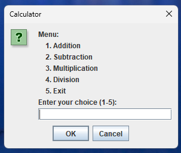
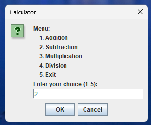
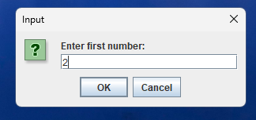
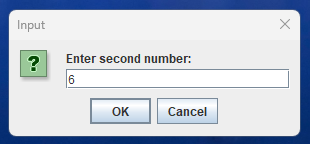

# Interactive Calculator

A lightweight desktop calculator built with Java Swing that turns button-clicks into instant arithmetic—because even numbers deserve a friendly conversation. 😏

## Tech stack

- Java
- Swing / JOptionPane
- Spring Boot launcher
- Gradle

## Run

Open and run `src/main/java/com/abd/interactivecalculator/InteractiveCalculatorApplication.java` from your IDE.

## Output

<table>
  <tr>
    <td></td>
    <td></td>
    <td></td>
  </tr>
  <tr>
    <td></td>
    <td></td>
    <td></td>
  </tr>
</table>

